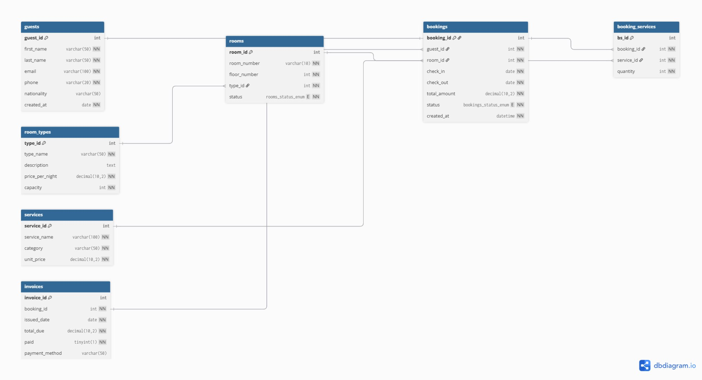

# Hotel Booking System — Database Project

A fully relational database modelling the operations of a hotel: guests, room types, rooms, bookings, services, invoices, and booking-service associations.

---

## Database: `hotel_booking`

Character set: `utf8mb4` — supports all characters including accents and special symbols.

---

## Part 1 — Tables (CREATE)

| Table | Description | Primary Key |
|---|---|---|
| `guests` | Hotel guests / customers | `guest_id` |
| `room_types` | Categories of rooms (Standard, Deluxe, Suite…) | `type_id` |
| `rooms` | Individual physical rooms | `room_id` |
| `bookings` | Reservation records | `booking_id` |
| `services` | Extra services available (breakfast, spa…) | `service_id` |
| `invoices` | Financial invoice per booking | `invoice_id` |
| `booking_services` | Junction table — M:N between bookings and services | `bs_id` |

### Relationships

| Pair | Type | Explanation |
|---|---|---|
| `room_types` ↔ `rooms` | 1:M | One room type can apply to many rooms |
| `guests` ↔ `bookings` | 1:M | One guest can make many bookings |
| `rooms` ↔ `bookings` | 1:M | One room can be booked many times (different dates) |
| `bookings` ↔ `invoices` | 1:1 | Each booking has exactly one invoice |
| `bookings` ↔ `services` | M:N | Via `booking_services` junction table |

---

## Part 2 — Data Population (INSERT)

Minimum number of rows inserted per table:

| Table | Rows inserted |
|---|---|
| `room_types` | 10 (Standard, Deluxe, Suite, Family, Presidential, Economy, Junior Suite, Twin, Penthouse, Studio) |
| `rooms` | 12 (floors 1 to 5) |
| `guests` | 12 (various nationalities: Burkinabé, French, Ghanaian, Ivorian…) |
| `bookings` | 12 (dates ranging from Jan to Jul 2025) |
| `services` | 10 (Breakfast, Spa, Airport Shuttle, Laundry…) |
| `invoices` | 12 (amounts in FCFA, various payment methods) |
| `booking_services` | 14 (links bookings to their consumed services with quantities) |

---

## Part 3 — Updates and Deletes (UPDATE / DELETE)

### UPDATE statements (5 total)

| # | Table | Action |
|---|---|---|
| 1 | `guests` | Update email address of guest 1 |
| 2 | `rooms` | Set room 203 back to `available` after maintenance |
| 3 | `room_types` | Increase Standard room price by 10% |
| 4 | `invoices` | Mark booking 11 invoice as paid (Cash) |
| 5 | `guests` | Update phone number of guest 8 |

### DELETE statements (2 total)

| # | Table | Action |
|---|---|---|
| 1 | `booking_services` | Remove spa service from booking 2 |
| 2 | `invoices` | Delete unpaid invoice for cancelled booking 8 |

### Referential Integrity Violation Demo

Attempting to delete a guest who has existing bookings triggers a MySQL error due to `ON DELETE RESTRICT`:

```sql
-- DELETE FROM guests WHERE guest_id = 1;
-- ERROR 1451 (23000): Cannot delete or update a parent row:
-- a foreign key constraint fails
```

This demonstrates that the foreign key constraints are working correctly.

---

## Part 4 — SELECT Queries

| Query | Concept demonstrated |
|---|---|
| Q1 | `SELECT *` — retrieve all records from `rooms` |
| Q2 | `WHERE` — filter guests by nationality (Burkinabé) |
| Q3 | `ORDER BY DESC` — sort bookings by total amount |
| Q4 | `LIMIT` — top 5 most expensive bookings |
| Q5a | `BETWEEN` — bookings between 100,000 and 400,000 FCFA |
| Q5b | `IN` — rooms on floors 2 or 4 |
| Q5c | `LIKE` — guests with 'ou' in last name |
| Q6 | `INNER JOIN` — bookings with guest names (2 tables) |
| Q7 | `LEFT JOIN` — all rooms, including those with no bookings (NULLs shown) |
| Q8 | Multi-table `JOIN` — booking details with guest name and room type (4 tables) |
| Q9a | `IS NULL` — unpaid invoices with no payment method |
| Q9b | `IS NOT NULL` — paid invoices with a recorded payment method |

---

## Part 5 — Aggregate Functions & Reporting

| Query | Function used | Description |
|---|---|---|
| Total bookings | `COUNT(*)` | Count all rows in `bookings` |
| Min / Max amounts | `MAX()` / `MIN()` | Most and least expensive booking |
| Average room price | `AVG()` | Average nightly price across all room types |
| Bookings per status | `GROUP BY` | Count bookings grouped by status (confirmed / cancelled / completed) |
| Room types with 1+ bookings | `GROUP BY` + `HAVING` | Only room types with more than 1 booking |
| Revenue report | `SUM()` + `AVG()` + `MAX()` + `GROUP BY` + `HAVING` | Revenue per room type, filtered to those exceeding 200,000 FCFA |

---

## How to Run

```sql
-- In MySQL client or Workbench:
SOURCE hotel_booking.sql;
```

Or from the terminal:
```bash
mysql -u root -p < hotel_booking.sql
```

---

## File Structure

```
hotel_booking_project/
├── README.md                      # This file
├── hotel_booking.sql              # Full SQL: CREATE, INSERT, UPDATE, DELETE, SELECT, AGGREGATES
├── schema_diagram.png             # ERD — Schema diagram (Part 1.3)
├── part1_3_schema_diagram.sql     # Schema documentation — all tables, columns, FK summary
├── part1_database_design.sql      # Entities, relationships and normalization (Parts 1.1, 1.2, 1.4)
├── part2_1_create_tables.sql      # CREATE DATABASE + all 7 tables
├── part2_2_insert_data.sql        # INSERT — minimum 10 rows per table
├── part2_3_update_delete.sql      # UPDATE, DELETE and referential integrity demo
├── part2_4_select_queries.sql     # All SELECT queries (Q1 to Q9)
└── part3_aggregates.sql           # Aggregate functions and summary report
```

---

## Part 1.3 — Schema Diagram (ERD)



---

## Normalization

### Unnormalized Form (UNF) — starting point

```
Booking(booking_id, guest_name, guest_email, guest_phone,
        room_number, room_type, price_per_night,
        check_in, check_out, total_amount,
        services_used, invoice_total, paid)
```

**1NF violation** — `services_used` is a multi-valued attribute (a guest can use multiple services, which violates atomicity).  
**Fix:** Extract each service into a separate row → `booking_services` junction table.

**2NF violation** — In a table with composite key (`booking_id`, `service_id`), attributes like `guest_email` depend only on `booking_id`, not the full key.  
**Fix:** Separate `guests`, `bookings`, and `services` into their own tables.

**3NF violation** — `price_per_night` depends on `room_type`, not on `room_id` directly — a transitive dependency.  
**Fix:** Extract `room_types` into its own table; `rooms` references it via `type_id`.

The final schema is in **3NF**: every non-key attribute depends on the whole key and nothing but the key.

---

## Key Design Decisions

- **`ENUM`** used for `rooms.status` (`available`, `occupied`, `maintenance`) and `bookings.status` (`confirmed`, `cancelled`, `completed`) — prevents invalid values at the database level.
- **`ON DELETE RESTRICT`** on all foreign keys — prevents accidental deletion of a guest or room that has associated bookings.
- **`ON DELETE CASCADE`** on `booking_services` — if a booking is deleted, its associated services are deleted automatically.
- **`ON UPDATE CASCADE`** — if a primary key is updated, all referencing rows update automatically.
- **`DECIMAL(10,2)`** for all monetary fields — avoids floating-point precision errors.
- **`TINYINT(1)`** for the `paid` field in `invoices` — acts as a boolean (0 = unpaid, 1 = paid).
- **`booking_services`** junction table — properly resolves the M:N relationship between bookings and services.
- **`UNIQUE`** on `invoices.booking_id` — enforces the 1:1 relationship between a booking and its invoice.
